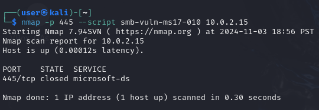

# Examen Parcial

### Pasos previos

**1 instalar la red NAT en el sistema atacante(kali linux)** 

**2 Verificar la instalacion de File Services del Role Services**

**3 Desactivar el FireWall**

**4 averiguar la ip de metaslpoit**

### 2.1. Escaneo de Red y Enumeración de Servicios

**Explicación del Comando:**

-p 139,445: Limita el escaneo a los puertos 139 y 445, los cuales son específicos para el servicio SMB.
--script smb-protocols: Este script de Nmap permite identificar las versiones de SMB activas en el objetivo. Es particularmente útil para verificar si SMBv1 (protocolo NT LM 0.12) está habilitado, ya que lista las versiones de SMB soportadas en el servidor.

**Análisis del Output del Comando**
Cuando ejecutamos este comando, buscamos específicamente en el resultado:

El término SMBv1 o protocolo NT LM 0.12.
Si el protocolo NT LM 0.12 aparece en la lista de protocolos, indica que el servicio SMBv1 está habilitado y es compatible con el servidor objetivo.

**explicacion de los dos comandos código nmap -p 139 y código nmap -p 445**

nmap: Invoca la herramienta Nmap.
-p 139 y -p 445: Especifica que se debe escanear únicamente el puerto 139. Este puerto está asociado con el protocolo NetBIOS Session Service (NetBIOS-SSN), comúnmente usado en sistemas Windows para compartir archivos e impresoras.
--script=smb-vuln*: Esta opción indica a Nmap que ejecute todos los scripts del motor de scripting NSE (Nmap Scripting Engine) que buscan vulnerabilidades en servicios SMB (Server Message Block). El asterisco (*) actúa como comodín, ejecutando todos los scripts que comienzan con "smb-vuln". Estos scripts buscan configuraciones inseguras o vulnerabilidades conocidas en servicios SMB.
10.0.2.15: Es la dirección IP del objetivo del escaneo. Nmap realizará el escaneo contra este host.

### 2.2. Exploración de la Vulnerabilidad 

###  EXPLICACION 1
Este comando Nmap realiza un escaneo específico para detectar la vulnerabilidad MS17-010 (EternalBlue) en un servidor SMB. Desglosemos cada parte:

nmap: Invoca la herramienta Nmap.
-p 445: Especifica que solo se escaneará el puerto 445. Este puerto es usado por el protocolo SMB (Server Message Block), comúnmente utilizado en sistemas Windows para compartir archivos e impresoras. A diferencia del puerto 139 (NetBIOS), el puerto 445 es el puerto principal para SMB en sistemas Windows modernos.
--script smb-vuln-ms17-010: Esta es la parte crucial del comando. --script indica que se ejecutará un script del motor de scripting NSE (Nmap Scripting Engine). smb-vuln-ms17-010 especifica que se ejecutará el script diseñado para comprobar la presencia de la vulnerabilidad MS17-010. Esta vulnerabilidad es una falla crítica en el servicio SMB de Microsoft que permite la ejecución remota de código. Exploits para esta vulnerabilidad fueron usados extensivamente por el ransomware WannaCry.
10.0.2.15: Esta es la dirección IP del objetivo del escaneo. Nmap realizará el escaneo contra este host.

###  EXPLICACION 2

El comando nmap -p 445 --script=smb-vuln* 10.0.2.4 es una instrucción para la herramienta Nmap que realiza un escaneo de vulnerabilidades en un servidor o sistema que se encuentra en la dirección IP 10.0.2.15. Vamos a desglosar cada parte del comando:

nmap: Esta es la herramienta de escaneo de red. Nmap es una utilidad de línea de comandos poderosa y versátil para descubrir hosts y servicios en una red.
-p 445: Esta opción especifica el puerto que Nmap debe escanear. El puerto 445 es el puerto estándar utilizado por el protocolo SMB (Server Message Block), un protocolo de red utilizado principalmente en sistemas Windows para compartir archivos e impresoras. Al especificar este puerto, le indicamos a Nmap que se centre solo en los servicios que escuchan en este puerto.
--script=smb-vuln*: Esta es la parte crucial del comando. Nmap tiene una gran cantidad de scripts que pueden ejecutar después de un escaneo inicial para buscar vulnerabilidades conocidas en los servicios detectados. --script=smb-vuln* le indica a Nmap que ejecute todos los scripts que comiencen con "smb-vuln". Estos scripts están diseñados para detectar vulnerabilidades específicas relacionadas con el protocolo SMB, como:
Vulnerabilidades de autenticación: Scripts que intentan detectar debilidades en el proceso de autenticación SMB, permitiendo posibles accesos no autorizados.
Vulnerabilidades de configuración: Scripts que buscan configuraciones inseguras del servidor SMB que podrían ser explotadas.
Vulnerabilidades conocidas: Scripts que buscan exploits para vulnerabilidades conocidas en versiones específicas del servidor SMB.
10.0.2.15: Esta es la dirección IP del objetivo del escaneo. Nmap realizará el escaneo en este sistema específico.

## Explica breve exploit/windows/smb/ms17_010_eternalblue
El exploit exploit/windows/smb/ms17_010_eternalblue es un módulo Metasploit que aprovecha la vulnerabilidad CVE-2017-0143 (también conocida como EternalBlue). Esta vulnerabilidad reside en el servicio SMBv1 de Microsoft Windows y permite a un atacante remoto ejecutar código arbitrario en un sistema vulnerable sin necesidad de autenticación.

El funcionamiento del exploit se basa en la explotación de un desbordamiento de búfer en el manejo de paquetes SMB. En esencia, el exploit envía un paquete SMB especialmente diseñado que contiene más datos de los que el servidor SMB está preparado para manejar. Este exceso de datos sobrescribe partes de la memoria del servidor, incluyendo la dirección de retorno de la función que procesa el paquete. Al controlar la dirección de retorno, el atacante puede redirigir la ejecución del programa a un código malicioso que él mismo proporciona, otorgándole control completo sobre el sistema.

Se selecciona este módulo en particular para obtener acceso remoto debido a su eficacia y a la amplia difusión de la vulnerabilidad CVE-2017-0143. Antes de su parcheo oficial, esta vulnerabilidad afectó a un gran número de sistemas Windows, desde versiones antiguas hasta versiones relativamente modernas. Su facilidad de explotación y la posibilidad de obtener acceso sin credenciales la convirtieron en una herramienta muy popular para ataques de ransomware como WannaCry y NotPetya. Aunque Microsoft lanzó parches para solucionar esta vulnerabilidad, muchos sistemas desactualizados permanecieron vulnerables durante un tiempo considerable, haciendo que este exploit fuera una opción atractiva para los atacantes.

### Configuración del Exploit en el Framework Metasploit

